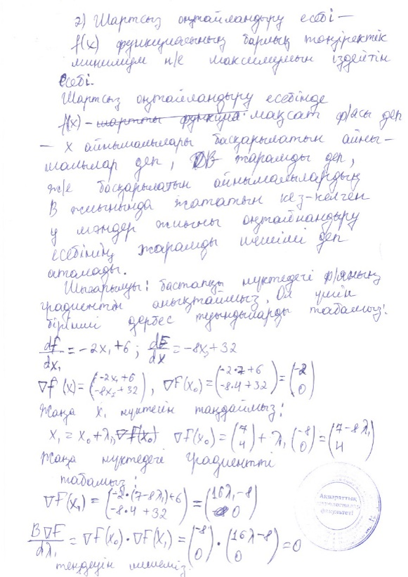
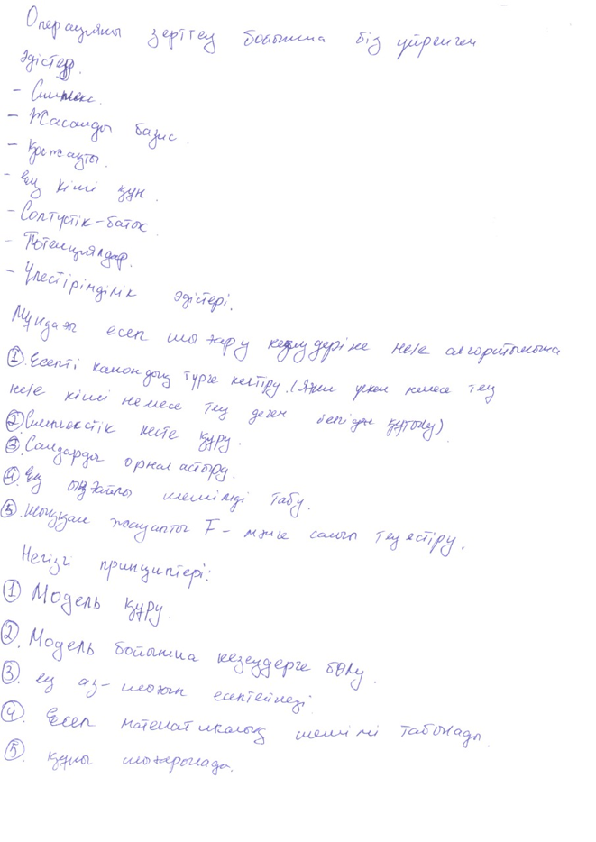
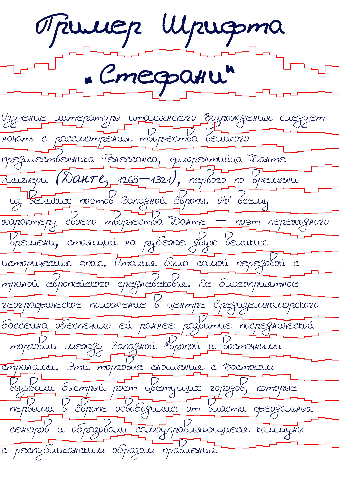

# KOHTD: Kazakh Offline Handwritten Text Dataset
[](https://pytorch.org/)
[](https://pytorch.org/)
[](https://pytorch.org/)


> **KOHTD: Kazakh Offline Handwritten Text Dataset**<br>
> [Nazgul Toiganbayeva](https://github.com/abdoelsayed2016), 
> [Mahmoud Kasem](),
> [Galymzhan Abdimanap](),
> [Kairat Bostanbekov](),
> [Abdelrahman Abdallah](https://github.com/abdoelsayed2016),
> [Anel Alimova](),
> [Daniyar Nurseitov](),
> <br>

    


## Abstract 
Despite the transition to digital information exchange, many documents, such as invoices, taxes, memos and questionnaires, historical data, and answers to exam questions, still require handwritten inputs. In this regard, there is a need to implement Handwritten Text Recognition (HTR) which is an automatic way to decrypt records using a computer. Handwriting recognition is challenging because of the virtually infinite number of ways a person can write the same message. For this proposal we introduce Kazakh handwritten text recognition research, a comprehensive dataset of Kazakh handwritten texts is necessary. This is particularly true given the lack of a dataset for handwritten Kazakh text. In this paper, we proposed our extensive Kazakh offline Handwritten Text dataset (KOHTD), which has 3000 handwritten exam papers and  more than 140335 segmented images and there are approximately 922010 symbols. It can serve researchers in the field of handwriting recognition tasks by using deep and machine learning. We used a variety of popular text recognition methods for word and line recognition in our studies, including CTC-based and attention-based methods. The findings demonstrate KOHTD's diversity. Also, we proposed a Genetic Algorithm (GA) for line and word segmentation based on random enumeration of a parameter.

## KOHTD Dataset

You can download the dataset through this  <a href="https://drive.google.com/file/d/1BD2Nx2kn79xJLKJRKlmAFASdAb03ODIH/view">link</a> 

Our database consists of a large collection of exam papers filled by students at Satbayev University and Al-Farabi Kazakh National University, this exam was made and answered in the Kazakh Language (99%) and Russian Language (1%) as shown in the folllowing Figure, after we received this exam answer, we scanned it and make experiments that related to pre-processing of the examination lists to automatically identifying lists, evaluate the contours of lists,recovering rotations, and also segmentation by line and by words so we can apply our Deep Learning model to recognize each word and remove the artifacts in the edges at the boundaries of segmented words. We have developed our intelligent software using state-of-the-art deep learning models to solve the problem of recognizing and processing natural language, which consists of optical character recognition of the manuscript texts in Kazakh and Russian languages.




<br clear="left">


## Line Segmentataion 
For line segmentation, we used a genetic algorithm. Genetic Algorithm (GA) is a classic evolutionary algorithm based on random enumeration of a parameter. By random here we mean that in order to find a solution using GA, random changes were applied to the current solutions to generate new ones. GA is based on Darwin's theory of evolution. It is a slow, gradual process that works by making small and slow changes. In addition, GA is slowly making small changes to its decisions until it gets the best solution.

in the  following figure segmented line  using GA. For more detail about GA please read our paper and you can use the code of GA from this <a href="https://github.com/GalymzhanAbdimanap/GeneticAlgorithm"> Link </a>.





## Citation and Contact
Please consider to cite our papers when you use our dataset:
```
@misc{toiganbayeva2021kohtd,
      title={KOHTD: Kazakh Offline Handwritten Text Dataset}, 
      author={Nazgul Toiganbayeva and Mahmoud Kasem and Galymzhan Abdimanap and Kairat Bostanbekov and Abdelrahman Abdallah and Anel Alimova and Daniyar Nurseitov},
      year={2021},
      eprint={2110.04075},
      archivePrefix={arXiv},
      primaryClass={cs.CV}
}
```


For any quetions about the dataset please contact the authors by sending email to Prof. Daniyar Nurseitov
([nurseitovdb@gmail.com](mailto:nurseitovdb@gmail.com)), Dr. Kairat Bostanbekov
([Kairat.boss@gmail.com](mailto:Kairat.boss@gmail.com)) , Abdelrahman Abdallah ([abdoelsayed2016@gmail.com](mailto:abdoelsayed2016@gmail.com)) 
